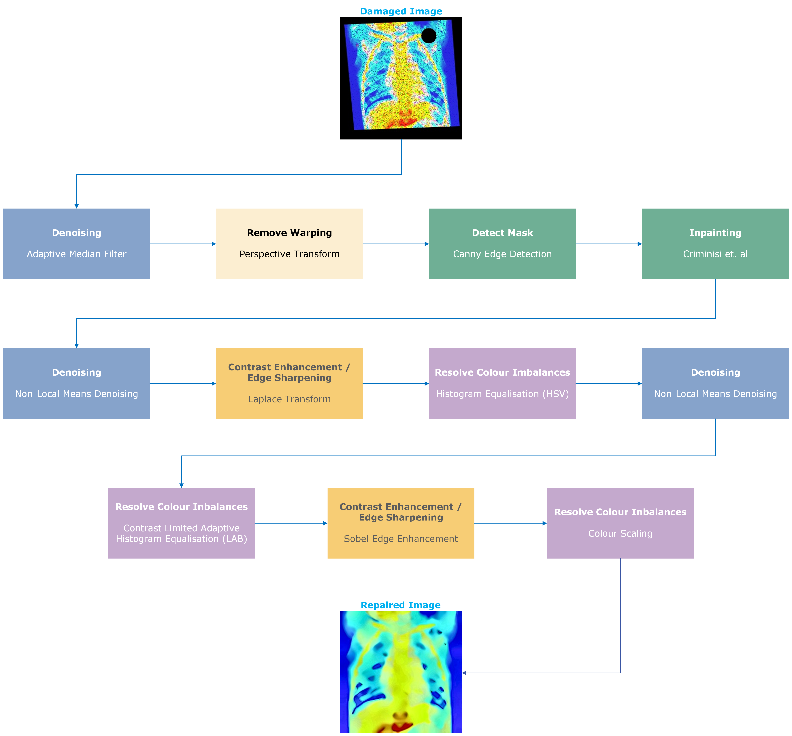

# 💫 About Me

Final-year MEng Computer Science student at Durham University, with interests spanning software development, application security, and applied machine learning.

My dissertation investigates detecting Borderline Personality Disorder from Reddit posts using hierarchical attention networks, transformer-based language models, and clinically grounded NLP features, with a focus on balancing predictive performance with explainability. Beyond research, I enjoy building things: JSGrades is an online qualification tracker I've been developing with React and Node.js; I've built image repair pipelines using OpenCV to restore damaged X-rays; and most recently I worked on interactive geospatial tools for analysing lunar south pole landing sites for the Artemis III mission using Python and PyGMT.

Accredited Affiliate Member of the Chartered Institute of Information Security · ITIL 4 Foundation Certified

Outside of work, I'm a big Formula 1 fan and always happy to talk race strategy.

## 🌐 Socials

 

## 💻 Tech Stack

#### Languages

         

#### Web

      

#### ML / NLP

   

#### Data

    

#### DevOps / Tools

      

## 📊 GitHub Stats

## 🏆 GitHub Trophies

## 💻 Projects

### FG-HAN: Feature-Guided Hierarchical Attention for BPD Detection from Social Media

My MEng dissertation proposes FG-HAN, a hierarchical attention network that aligns three parallel attention heads to the interpersonal, emotional, and behavioural dimensions of Sanislow et al.'s (2000) three-factor model of BPD via additive psycholinguistic feature bias on the attention logits. The task is binary classification (BPD vs control) over Reddit posts, where subreddit membership serves as a proxy label and control communities are drawn from clinically adjacent conditions (e.g. bipolar, PTSD, CPTSD, depression) that drive real-world misdiagnosis. Crucially, FG-HAN produces explanations decomposed along the three clinical dimensions without requiring any per-factor annotation in the dataset.

- FG-HAN matched the strongest transformer baselines on classification (Macro F1 0.874) while producing significantly more specialised heads than its unguided counterpart (composed JSD 0.645 vs 0.380, p < 0.001)
- Evaluated 13 architectures from logistic regression to pretrained transformers alongside a cross-architecture faithfulness comparison of four attribution methods, finding that method choice affects faithfulness more than architecture
- **Tech:** Python, PyTorch, HuggingFace Transformers, LIWC, NRC-VAD, Empath, scikit-learn

> Code and full results to follow after examination.

---

### Artemis III Lunar South Pole Landing Site Analysis

An interactive geospatial analysis tool for evaluating candidate landing sites for NASA's Artemis III mission at the lunar south pole. Built as part of COMP4097 Advanced Visualisation, using real LOLA elevation data and illumination overlays.

- Implemented slope computation via Horn's (1981) kernel with latitude correction and TOPSIS-based multi-criteria suitability scoring across candidate sites
- Built two interactive visualisation tools using PyGMT for terrain rendering, illumination analysis, and candidate site comparison

> Code to follow after examination.

---

### Image Processing to Repair Damaged X-Rays with OpenCV

A pipeline to repair damaged X-ray images and improve the performance of a pretrained classifier, built with OpenCV and Python.

- Improved classifier accuracy from 0.55 (baseline) to 0.90 through noise reduction, inpainting, and edge detection techniques
- Applied Canny Edge Detection to identify missing regions and Criminisi's Inpainting Algorithm for realistic image restoration
- **Tech:** Python, OpenCV, NumPy

[Link to repo](https://github.com/jsduxie/opencv-xray-repair)

---

### Semantic Scholar Research Paper Monitor

An automated research monitoring agent that tracks new publications across specified topics using the Semantic Scholar API and generates daily digest emails summarised by Gemini AI. Built to keep on top of the BPD/mental health NLP literature during my dissertation.

- Integrates Semantic Scholar API for paper discovery with Gemini AI for summarisation and relevance filtering
- Delivers daily email digests of new and relevant papers matching configurable research interests

[Link to repo](https://github.com/jsduxie/researcher-agent)
